<h1 align="center">Hola, soy Sergio 👨‍💻</h1>

  <i>Ingeniero de Sistemas | Desarrollador Web Fullstack</i> 
  Apasionado por crear soluciones digitales eficientes, escalables y visualmente impactantes.

---

### 🚀 Sobre mí

Soy **Ingeniero de Sistemas** con una sólida trayectoria como desarrollador web, especializado en construir aplicaciones robustas e intuitivas. Trabajo con metodologías ágiles y me encanta colaborar en equipo para entregar soluciones de calidad.

- 🎯 Enfocado en la eficiencia, escalabilidad y buenas prácticas
- 🔧 Backend robusto con **Nest.js** y **Node.js**
- 🎨 Frontend moderno con **Angular**, **Tailwind** y **Bootstrap**
- 🧠 Fan de la arquitectura limpia, Docker y CI/CD

---

### 🛠️ Tecnologías y Herramientas

  

---

### 📊 Mi Stack

```mermaid
graph TD;
    A[Frontend] -->|SPA| B[Angular]
    B --> C[HTML/CSS/TS]
    A --> D[Tailwind/Bootstrap]
    A --> E[Responsiveness]

    F[Backend] -->|API REST| G[Nest.js]
    G --> H[Node.js]
    G --> I[Typescript]
    F --> J[Autenticación JWT]

    K[Base de Datos] --> L[PostgreSQL]
    K --> M[MySQL]

    N[DevOps] --> O[Docker]
    N --> P[Git + GitHub]

```

---

### 📬 Contacto

  
  
  

